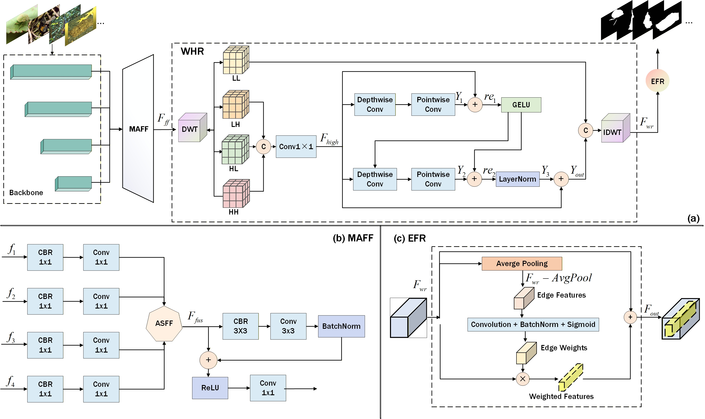
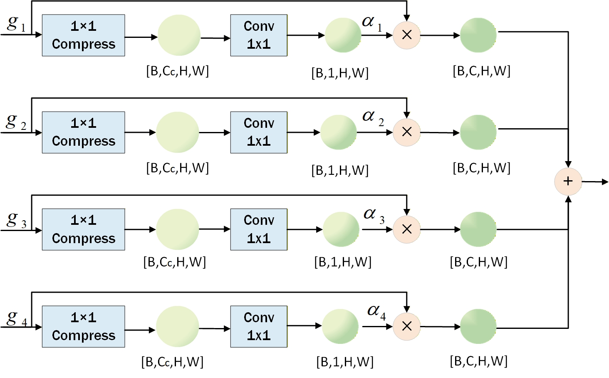

# WCAF-Net: Wavelet-enhanced Consensus Adaptive Fusion Network for Collaborative Camouflaged Object Detection

> **Authors:** 
> [Shiyuan Li](https://github.com/LSY20030127/), Hongbo Bi, Yulin Zeng, [Cong Zhang](https://github.com/zc199823/), Yue Li

## 1. Dataset

CoCOD8K can be download from [here](https://pan.quark.cn/s/5bdc87f4e0c0)[code:tdYx] or [Google Drive](https://drive.google.com/file/d/1wyLfm0QhpOsgM5NoNcGCbgXnzQzBAJiX/view?usp=sharing) .

## 2. Overview

      
    <em> 
    Figure 1: The overview of the WCAF-Net. We designed the Multi-scale Adaptive Feature Fusion (MAFF), the Wavelet-enhanced High-frequency Reconstruction (WHR) and the Edge-aware Feature Refinement (EFR).
    </em>

## 3. Proposed Framework

### 3.1 Method

      
    <em> 
    Figure 2: The detailed information of the ASFF.
    </em>

### 3.2 Training/Testing

The training and testing experiments are conducted using PyTorch with  a NVIDIA GeForce RTX 3090 GPU.

1. Prerequisites:

Note that WCAF-Net is only tested on Ubuntu OS with the following environments. It may work on other operating systems (i.e., Windows) as well but we do not guarantee that it will.

 + Creating a virtual environment in terminal: `conda create -n WCAF-Net python=3.6`.
 + Installing necessary packages: [PyTorch > 1.1](https://pytorch.org/), [opencv-python](https://pypi.org/project/opencv-python/)

2. Prepare the data:
   + downloading testing dataset and moving it into `./Dataset/TestDataset/`.
    + downloading training/validation dataset and move it into `./Dataset/TrainDataset/`.
    + downloading pvt_v2_b2 weights and move it into `./pth/backbone/pvt_v2_b2.59` [download link](https://pan.quark.cn/s/51993452f527).
   
3. Training Configuration:

   + Assigning your costumed path, like `--train_save` and `--train_path` in `train.py`.

   + Just enjoy it via run `python train.py` in your terminal.

4. Testing Configuration:

   + After you download all the pre-trained models and testing datasets, just run `test.py` to generate the final prediction map: 
     replace your trained model directory (`--pth`).

   + Just enjoy it!

### 3.3 Evaluating your trained model:

You can evaluate the result maps using the tool from [here](https://pan.quark.cn/s/67b5cb4ace08).

### Citation

Shiyuan Li, Hongbo Bi, Yulin Zeng, Cong Zhang, Yue Li. WCAF-Net: Wavelet-enhanced Consensus Adaptive Fusion Network for Collaborative Camouflaged Object Detection

